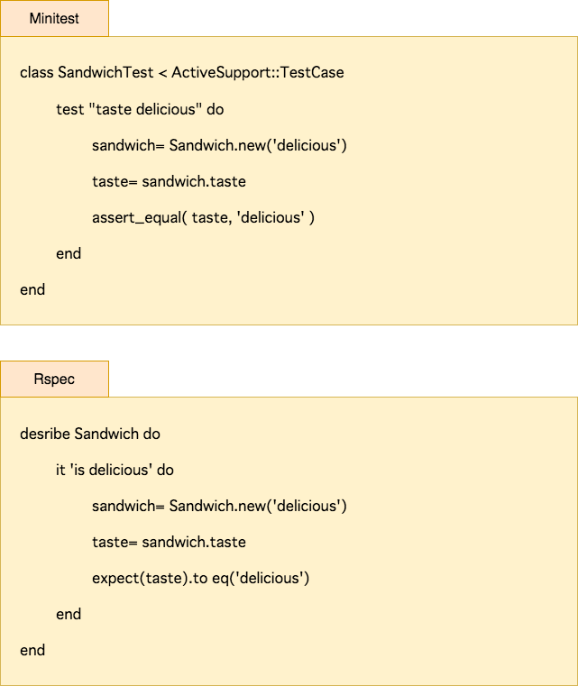
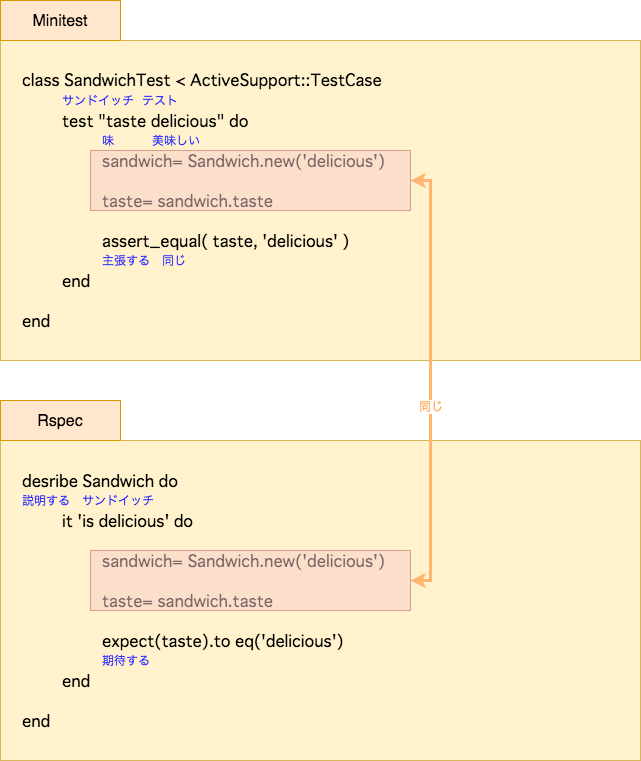

# 振る舞い駆動開発とは

## TDDとの関係

BDD(振る舞い駆動開発)は、TDDから発展して提唱された考え方です。
このため、まずは TDDについて説明します。

TDDという開発手法ができる前は、ソフトウェアの挙動を確認するには手動で動かしてみるしかありませんでした。
要求通りにソフトウェアが動作しているかを、確認することは多くの工数がかかり、困難がともないます。
このために、「動いているものは触らない」文化が醸成され、巨大なスパゲッティコードがたくさん作成されました。

TDDは、最初にテストコードを書き（テストファースト）、テストコードがグリーンになるように実装を行い、グリーンを維持しながらリファクタリングを行うというサイクルで開発する手法です。
テストが安全ベルトのように働き、仕様が維持されていることを保証してくれるため、不安なくリファクタリングを行うことができます。

## BDDの提唱

しかし、TDDのテストという言葉には、少し誤解を招くニュアンスがあります。
TDDは、テストの手法というよりも、設計を不安なく実装するための手法です。
この理由から、Dan North が 2006年に提唱したのが、Behavior driven development BDD です。

TDDとBDDの違いは、実際のところは用語だけとも言えます。
けれども、特に仕様を記載するようなタイミングで、わたしたちは使っている言葉にとても影響されます。
そのことを、実際にコードを書きながら、体験して頂きたいと思います。

## Rspec について

BDDというのは手法であり、考え方なので、当然ながら、Rspec = BDD ではありません。
しかし、BDDの考え方にうまくフィットするように、Rspec は作られています。
以下のコード例は、xUnit系のユニットテストフレームワークの Minitest で書いたテストと、同じ内容をRspecで書いたものです。

Minitest と Rspec で同じ記載をしている部分もあることが判ります。
Minitestの「テストする」、Rspecの「仕様を書く」というそれぞれの表現を比較してみてください。

